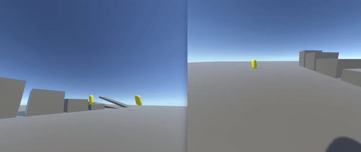

# Unity First Person Rigidbody Controller with Client Side Prediction using Riptide Networking

<p align="center">
  
</p>

# About

This project implements a simple first person rigidbody controller with client side prediction using Riptide Networking. If you would like to learn more about networked physics checkout the [Unity Client Side Physics Prediction using Riptide Networking project](https://github.com/JasonLash/UnityRiptidePhysics). 

# Differences

This project is built on top of: [Unity Client Side Physics Prediction using Riptide Networking project](https://github.com/JasonLash/UnityRiptidePhysics). I recommend you checkout that repository first.

The movement is implemented from: https://www.youtube.com/watch?v=LYWw-ZxHw5k . Code: https://gist.github.com/aeughsendhelp/233e64ca2293ed4ac04de396b83167db

### New Movement 
```cs
grounded = Physics.CheckSphere(checkSphere.position, checkSphereRadius, groundLayerMask);

Vector2 inputDirection = getDirectionFromInputs(inputs);

if (inputs[4] && grounded)
{
    rb.AddForce(new Vector3(0, jumpForce, 0));
}


rb.AddForce((lookDirection * Vector3.right) * inputDirection.x * moveForce);
rb.AddForce((lookDirection * Vector3.forward) * inputDirection.y * moveForce);


Vector3 vel = new Vector3(rb.velocity.x, 0, rb.velocity.z);
rb.AddForce(-vel * (moveForce / maxMoveSpeed), ForceMode.Acceleration);

rb.AddForce(Physics.gravity.y * Vector3.up * gravityScale, ForceMode.Acceleration);
```

Turned off gravity on the rigidbody player, increased mass to 50

<p align="center">
  
</p>

Very important to track the players orientation. The orientation stays client side authoritative. 

```cs
private SimulationState CurrentSimulationState(Rigidbody rb)
{
    return new SimulationState
    {
        position = rb.position,
        rotation = orientation.transform.rotation,
        currentTick = cTick
    };
}
```

When you’re reconciling, it is important to take into account the players camera rotation at the given tick. 

```cs
while (rewindTickNumber < cTick)
{
    cacheIndex = rewindTickNumber % CacheSize;

    clientStateCache[cacheIndex] = CurrentSimulationState(rb);

    PhysicsStep(inputCache[cacheIndex].Inputs, inputCache[cacheIndex].rotation);
    Physics.Simulate(deltaTickTime);

    ++rewindTickNumber;
}
```

# Acknowledgements

https://github.com/RiptideNetworking/Riptide

https://www.youtube.com/@tomweiland

https://www.codersblock.org/blog/client-side-prediction-in-unity-2018

https://github.com/spectre1989/unity_physics_csp

https://gafferongames.com/

https://github.com/DoctorWh012/Client-Side-Prediction-Physics

https://www.youtube.com/watch?v=LYWw-ZxHw5k

https://gist.github.com/aeughsendhelp/233e64ca2293ed4ac04de396b83167db